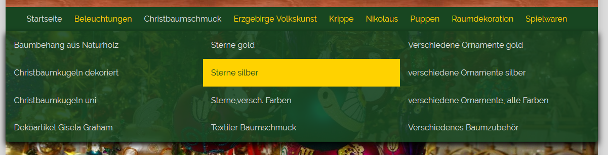
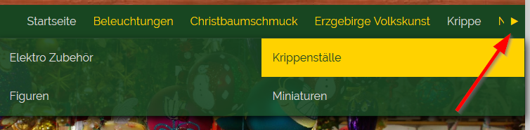
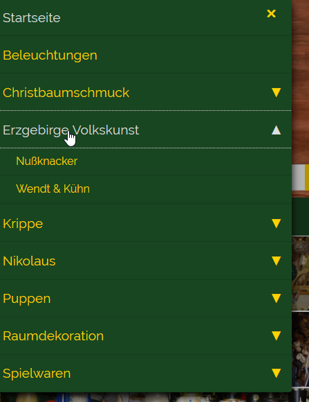

# Oxid navigationbar

## Description

Replace existing categorie navigation bar. Main goal is a better usibility for mobile pages and shop which has
many categories. 

This module is made for Oxid 6 wave theme.

## Good to know

The module use "scss" instead of "css". For use out of the box you need the "oxid-optimize" module which convert the styles.

Each theme has it´s own "scss" file and you can add your own and link to that in the module settings. The files are located at

    Modules Folder/out/src/css/theme

The navigation bar can display CMS text directly with the menu (only large). To display the CMS-Ident you need, you can enable 
the "Display CMS-Ident for snippets in the navigation bar" to see the CMS-Ident in the shop itself. The CMS-Ident is different 
for each sub menu. Disable this option if you copy and past the CMS-Ident to keep the navigation bar nice for the users.

On touch devices, the root categorie can't click directly if a sub menu is present. Instead opening the categorie, it display/hide
the sub menu on touch.

## Install

1. Copy files into following directory
        
        source/modules/rs/navigationbar
        
2. Add to composer.json at shop root
  
        "autoload": {
            "psr-4": {
                "rs\\navigationbar\\": "./source/modules/rs/navigationbar"
            }
        },

3. Refresh autoloader files with composer.

        composer dump-autoload
        
4. Enable module in the oxid admin area, Extensions => Modules
